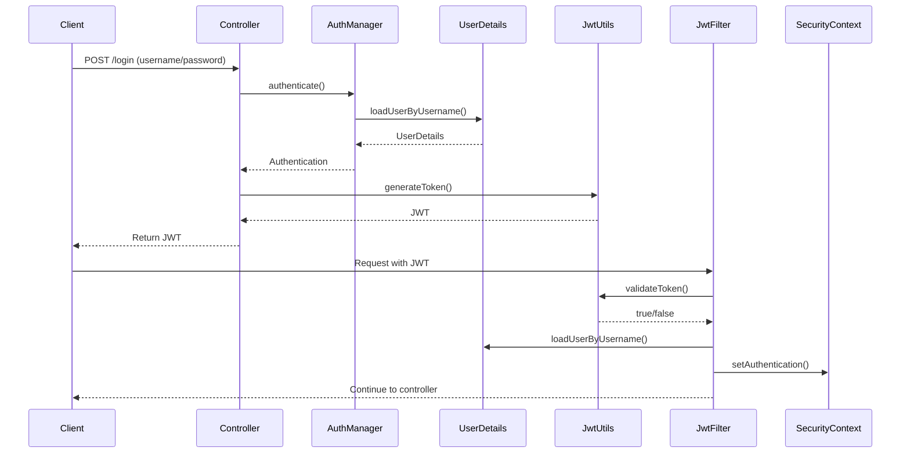

# 后端接口文档

### 身份验证流程图



### 异常返回

若操作存在异常，返回的数据结构如下：

`ErrorResponse`

+ error: String 异常类型
+ message: String 异常信息
+ path: String 异常接口
+ details: List\<String\>  详细异常详细，只有在出现 ValidationException 时才不为空

# API

**注意：带*的 api 存在权限问题，目前尚未加入权限验证，因此不应使用**

## 用户（User）

### 注册

**POST** `/api/users/register`

请求体：`RegisterRequest`

```json
{
	"username": "user1",
  "password": "password",
  "email": "user1@example.com"
}
```

返回数据

+ 状态码：成功（200 *ok*）；失败（400 *Bad Request*）；
+ 数据：`RegisterResponse` （redirectUrl）

### 登录

**POST** ` /api/users/login`

请求体：`LoginRequest`

```json
{
  "username": "user1",
  "password": "password1"
}
```

返回数据

+ 状态码：成功（200 *ok*）；密码错误（401 *Unauthorized*）；用户不存在（404 *NotFound*）
+ 数据：`LoginResponse` （token）

### 获取当前用户信息

需在登录状态下访问，即请求头需包含token

**GET** `/api/users/current`

请求体：无

返回数据

+ 状态码：成功（200 *ok*）；未登录（403 *Forbidden*）

+ 数据：`UserProfileResponse`

### 删除当前用户

需在登录状态下访问，即请求头需包含token

**DELETE** `/api/users/current`

请求体：无

返回数据

+ 状态码：成功（204 *NoContent*）；未登录（403 *Forbidden*）

+ 数据：空

### *获取指定用户信息

*  `GET /api/users/{userId}`
*  `User`

### *获取所有用户

* `GET /api/users`
* `List<Users>`

---

## 商品（Product）

### 获取所有商品信息（简略）

**GET** `/api/products`

请求体：无

返回数据

+ 状态码：成功（200 *ok*）；

+ 数据：`ProductCardsResponse`

### 获取指定商品信息（详细）

**GET** `/api/products/{productId}`

*  `ProductResponse`

### *创建商品

**POST** `/api/products`

请求体：`CreateProductRequest`

```json
{
  "name": "iPhone 15",
  "image": "image",
  "price": 7999.00,
  "stock": 3,
  "description": "苹果最新手机",
  "category"?: "category",
  "rating"?: 3.5
}
```

返回数据

+ 状态码：成功（200 *ok*）；校验失败（400 *Bad Request*）

+ 数据：`ProductCardsResponse`

### *更新商品

**POST** `/api/products/{productId}`

请求体：`UpdateProductRequest`

+ 同创建商品

返回数据

+ 状态码：成功（200 *ok*）；校验失败（400 *Bad Request*）

+ 数据：`ProductCardsResponse`

### *删除商品

**DELETE** `/api/products/{productId}`

请求体：`DeleteProductRequest`

返回数据

- 状态码：成功（204 *NoContent*）；

- 数据：空

---

## 购物车（Cart）

该模块的所有 api 都必须在在登录状态下访问，即请求头需包含 token，否则返回 403 *Forbidden*

### 获取登录用户的所有购物车

**GET** `/api/carts/my-carts`

返回数据

+ 状态码：成功（200 *ok*）；未登录（403 *Forbidden*）

*  数据：`List<CartResponse>`

### 增加购物车

**POST** `/api/carts/my-carts`

请求体：空

返回数据

+ 状态码：成功（200 *ok*）；未登录（403 *Forbidden*）

+ 数据：`CartResponse`

### 添加购物车项

**POST** `/api/carts/{cartId}/items`

请求体：`AddCartItemRequest`

```json
{
  "productId": 2,
  "quantity": 3
}
```

返回数据

+ 状态码：成功（200 *ok*）；未登录（403 *Forbidden*）

+ 数据：`CartResponse`

### 更新购物车项

**POST** `/api/carts/{cartId}/items/{cartItemId}`

请求体：`UpdateCartItemRequest`

``` json
{
  "quantity": 3
}
```

返回数据

- 状态码：成功（200 *ok*）；未登录（403 *Forbidden*）；超过库存（400 *Bad Request*）

- 数据：`CartResponse`

### 删除单个购物车项

**DELETE** `/api/carts/{cartId}/items/{cartItemId}`

请求体：无

返回数据

- 状态码：成功（200 *ok*）；未登录（403 *Forbidden*）

- 数据：`CartResponse`

### 清空购物车

**DELETE** `/api/carts/{cartId}/items`

请求体：无

返回数据

- 状态码：成功（200 *ok*）；未登录（403 *Forbidden*）

- 数据：`CartResponse`

### 删除购物车

**DELETE** `/api/carts/{cartId}`

请求体：无

返回数据

- 状态码：成功（204 *NoContent*）；未登录（403 *Forbidden*）

- 数据：空

---

## 收藏夹（Favorite）

该模块的所有 api 都必须在在登录状态下访问，即请求头需包含 token，否则返回 403 *Forbidden*

### 获取登录用户的所有收藏夹

**GET** `/api/favorites/my-favorites`

返回数据

+ 状态码：成功（200 *ok*）；未登录（403 *Forbidden*）

*  数据：`List<FavoriteResponse>`

### 增加收藏夹

**POST** `/api/favorites/my-favorites`

请求体：`CreateFavoriteRequest`

```json
{
  "name"?: "favorite1"
}
```

返回数据

+ 状态码：成功（200 *ok*）；未登录（403 *Forbidden*）

+ 数据：`FavoriteResponse`

### 添加收藏夹项

**POST** `/api/favorites/{favoriteId}/items`

请求体：`AddFavoriteItemRequest`

```json
{
  "productId": 2,
}
```

返回数据

+ 状态码：成功（200 *ok*）；未登录（403 *Forbidden*）

+ 数据：`FavoriteResponse`

### 删除单个收藏夹项

**DELETE** `/api/favorites/{favoriteId}/items/{favoriteItemId}`

请求体：无

返回数据

- 状态码：成功（200 *ok*）；未登录（403 *Forbidden*）

- 数据：`FavoriteResponse`

### 清空收藏夹

**DELETE** `/api/favorites/{favoriteId}/items`

请求体：无

返回数据

- 状态码：成功（200 *ok*）；未登录（403 *Forbidden*）

- 数据：`FavoriteRResponse`

### 删除收藏夹

**DELETE** `/api/favorites/{favoriteId}`

请求体：无

返回数据

- 状态码：成功（204 *NoContent*）；未登录（403 *Forbidden*）

- 数据：空

---

## 订单（Order）

该模块的所有 api 都必须在在登录状态下访问，即请求头需包含 token，否则返回 403 *Forbidden*

### 获取登录用户所有订单

**GET** `/api/orders/my-orders`

返回数据

+ 状态码：成功（200 *ok*）；未登录（403 *Forbidden*）

*  数据：`List<OrderResponse>`

### 创建订单（通过购物车项列表）

**POST** `/api/orders/my-orders`

请求体：`CreateOrderRequest`

```json
{
  cartItemIds: [1, 2, 3]
}
```

返回数据

+ 状态码：成功（200 *ok*）；未登录（403 *Forbidden*）；列表为空（400 *Bad Request*）

+ 数据：`OrderResponse`

### 更新订单状态

**POST** `/api/orders/{orderId}/status`

请求体：`UpdateOrderRequest`

```json
 {
   "status": "paid"
 }
```

返回数据

+ 状态码：成功（200 *ok*）；未登录（403 *Forbidden*）；未知状态（400 *Bad Request*）

+ 数据：`OrderResponse`

### 删除订单

**DELETE** `/api/orders/{orderId}`

请求体：无

返回数据

- 状态码：成功（204 *NoContent*）；未登录（403 *Forbidden*）

- 数据：空

### *获取平台所有订单

**GET** `/api/orders`

---

## 支付（Payment）

该模块的所有 api 都必须在在登录状态下访问，即请求头需包含 token，否则返回 403 *Forbidden*

### 获取登录用户所有支付记录

**GET** `/api/payments/my-payments`

请求体：无

返回数据

- 状态码：成功（200 *ok*）；未登录（403 *Forbidden*）

- 数据：`List<PaymentResponse>`

### 获取指定支付记录

**GET** `/api/payments/{paymentId}`

请求体：无

返回数据

- 状态码：成功（200 *ok*）；支付记录不存在（404 *Not Found*）；未登录（403 *Forbidden*）

- 数据：`PaymentResponse`

### 获取某订单的支付记录

**GET** `/api/payments/orders/{orderId}`

请求体：无

返回数据

- 状态码：成功（200 *ok*）；订单或支付记录不存在（404 *Not Found*）；未登录（403 *Forbidden*）

- 数据：`PaymentResponse`

### 创建支付记录

**POST** `/api/payments`

请求体：`CreatePaymentRequest`

```json
 {
   "orderId": 1,
   "amount": 10000,
   "paymentMethod": "alipay",
   "status"?: "pending"
 }
```

返回数据

- 状态码：成功（200 *ok*）；订单不存在（404 *Not Found*）；校验失败（400 *Bad Request*）；未登录（403 *Forbidden*）

- 数据：`PaymentResponse`

### 更新支付状态

**POST** `/api/payments/{paymentId}/status`

请求体：`UpdatePaymentRequest`

```json
 {
   "status": "paied"
 }
```

返回数据

- 状态码：成功（200 *ok*）；支付记录不存在（404 *Not Found*）；未知状态（400 *Bad Request*）；未登录（403 *Forbidden*）

- 数据：`PaymentResponse`

### 删除支付记录

DELETE `/api/payments/{paymentId}`

请求体：无

返回数据

- 状态码：成功（204 *NoContent*）；未登录（403 *Forbidden*）；权限问题（401 *Unauthorized*）

- 数据：空

### *获取平台所有支付记录

**GET** `/api/payments`

---

## 邮件（Email）

该模块的所有 api 都必须在在登录状态下访问，即请求头需包含 token，否则返回 403 *Forbidden*

### 获取登录用户的所有邮件

**GET** `/api/emails/my-emails`

返回数据

- 状态码：成功（200 *ok*）；未登录（403 *Forbidden*）；

- 数据：`List<EmailResponse>`

### 获取指定邮件

**GET** `/api/emails/{emailId}`

返回数据

- 状态码：成功（200 *ok*）；未登录（403 *Forbidden*）；邮件不存在（404 *Not Found*）；权限问题（401 *Unauthorized*）

- 数据：`EmailResponse`

### 发送邮件（添加记录）

*这个api是系统级api，无需登录验证*

**POST** `/api/emails`

请求体：`SendEmailRequest`

```json
{
  "userId": 1,
  "subject": "订单已发货",
  "content": "您的订单已发货，请注意查收"
}
```

返回数据

- 状态码：成功（200 *ok*）；校验问题（400 *Bad Request*）

- 数据：`EmailResponse`


### 删除邮件

**DELETE** `/api/emails/{emailId}`

请求体：无

返回数据

- 状态码：成功（204 *NoContent*）；未登录（403 *Forbidden*）；权限问题（401 *Unauthorized*）

- 数据：空

### *获取平台所有邮件

**GET** `/api/emails`

